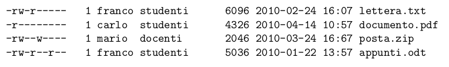
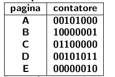

**DOMANDA 1**
Supponiamo di voler inviare il segnale di terminazione ```SIGTERM (15)``` al processo di PID 153. Che
chiamata di sistema utilizzereste tra le seguenti?

​		A. ```signal(153, SIGTERM)```
​		B. ```snd(153, SIGTERM, 0)```
​		C. ```kill(153, SIGTERM)```
​		D. ```msgsnd(SIGTERM, 153, null)```
​		E. ```sendsignal(SIGTERM, 153)```

**RISPOSTA: C**

**DOMANDA 2**
Supponiamo di avere cinque processi: **P1, P2, P3, P4 e P5** con rispettive durate: **7, 5, 2, 4, 4** secondi. Supponiamo anche che i tempi di arrivo nella coda di scheduling dei vari processi sia, rispettivamente: **0, 3, 4, 6 e 9** secondi (ovvero, ad esempio, P4 arriva a tempo 6). Assumendo di utilizzare l’algoritmo di scheduling **Shortest Remaining Time Next**, quale è il processo che sarà schedulato per ultimo? Riportare solo il nome del processo.

**Step-by-step:**
P1 arriva a tempo t = 0, viene schedulato in assenza di altri processi.
A tempo t = 3 il processo P2 è pronto per essere eseguito. P1 ha 7 - 3 = 4 tempo rimanente, P2 invece ha durata 5. Viene schedulato ancora P1 finché a tempo t = 4 arriva P3 che viene schedulato e terminato a tempo t = 6.
A tempo t = 6  P1 ha durata rimanente 3 secondi, P2 5 secondi ed è arrivato in coda P4 con 4 secondi di tempo. Viene eseguito P1 fino a terminazione a tempo t = 9. Vengono schedulati e terminati senza interruzioni prima P4, poi P5, viene schedulato per ultimo P2.

**Euristica:**
Si può evincere facilmente perchè il processo P2 ha il tempo rimanente più grande e gli altri processi hanno tutti tempi più piccoli e arrivano subito dopo di lui quindi non ci sono intervalli "scoperti" in cui può venire schedulato.

**RISPOSTA: Il processo P2 è l'ultimo a venire schedulato**

**DOMANDA 3**
Supponiamo di essere l’utente ```root``` su un sistema UNIX e di appartenere al gruppo ```admin```. Indicare esattamente quali dei seguenti file potrei riuscire a leggere senza problemi.



**Risposta: l'ultimo file è l'unico con i permessi di lettura abilitati per gli utenti esterni al gruppo, compreso l'utente ```root``` quindi. Disponendo di privilegi di root si può agilmente modificare la maschera dei permessi per tutti gli altri file così da renderli leggibili.** 

**DOMANDA 4**
Con riferimento all’algoritmo di scheduling SJF visto a lezione, individuare quale delle seguenti affermazioni è falsa.

A. Non utilizza preemption ma può eventualmente essere adattato.
B. E’ di difficile impiego nella pratica su sistemi interattivi.
C. Il tempo di turnaround è ottimale in presenza di job con tempi di arrivo non nulli.
D. E’ pensato per funzionare con processi prettamente non-interattivi (niente I/O).
E. Necessita la conoscenza a priori del tempo che il job impiegherà per completarsi.

**RISPOSTA: La C è falsa. SJF è ottimale proprio quando i job arrivano tutti a tempo 0.**

**DOMANDA 5**
Supponiamo di utilizzare un semaforo mutex per coordinare l’operato di alcuni processi su alcune strutture condivise. Al termine delle operazioni da parte di tutti i processi, che valore ci aspettiamo di vedere per il semaforo Indicare il valore esatto.

**RISPOSTA: tipicamente i semafori vengono inizialmente settati a 1 così che una seconda operazione di ```down``` sullo stesso semaforo sia bloccante. Se il numero di ```up``` e il numero di ```down``` di equivalgono e la prima operazione è una ```down``` il semaforo avrà valore 1. Se ci sono più ```up``` che ```down```  il semaforo avrà un valore maggiore di 1. In maggioranza di ```down``` avremo uno o più processi in attesa, un sistema di mutua esclusione non troppo ben pensato  e un semaforo a 0.**

**DOMANDA 6**
Abbiamo visto come sfruttare il parallelismo anche sui dischi, in particolare abbiamo parlato delle varie configurazioni RAID (livelli RAID). Supponendo di essere interessati unicamente a migliorare le prestazioni nell’accesso ai nostri dati rispetto all’uso di una singola unità, quale livello RAID scegliereste?

A. RAID 0
B. RAID 4
C. RAID 1
D. RAID 3
E. RAID 5

**RISPOSTA: A. Il RAID 0 offre prestazioni ottimali a discapito della fault tollerance.**

**DOMANDA 7**
Supponiamo di utilizzare un file-system UNIX basato su i-node particolari che contengono i seguenti campi: 12 indirizzi diretti a blocchi di dati, 1 indirizzo ad un blocco indiretto singolo e 1 indirizzo ad un blocco indiretto doppio. Supponendo di avere numeri di blocchi a 32 bit e blocchi su disco da 1 kb, indicare esattamente la dimensione massima (in kb) supportata da un simile i-node. Esplicitare il calcolo utilizzato.

**DOMANDA 8**
Supponiamo di eseguire la seguente sequenza di comandi su una shell UNIX all’interno di una cartella vuota:

```bash
echo -e "Franco\nGiovanni\nDario" > nomi.txt
ln nomi.txt nomi2.txt
cat nomi.txt | grep ’n’ > nomi3.txt
rm nomi.txt
mv nomi3.txt nomi.txt
cat nomi2.txt
```

Secondo voi, quale è l’output dell’ultimo comando?

**RISPOSTA: La lista dei nomi così come è stata scritta inizialmente. Il link generato da ``ln`` di default dovrebbe essere un hard-link e alla cancellazione di ```nomi.txt``` essendoci ancora un riferimento il contenuto del file rimane disponibile. In questo caso non stiamo puntando al nuovo ``nomi.txt`` (``nomi3.txt`` rinominato).**

**DOMANDA 9**
Tra gli algoritmi di sostituzione delle pagine abbiamo visto l’algoritmo di Aging. Tale algoritmo mantiene per ogni pagina un contatore binario che viene aggiornato periodicamente tenendo conto del bit di riferimento delle varie pagine. Supponiamo di avere 5 pagine in memoria e che a tempo *t* lo stato dei contatori binari sia il seguente:



In seguito, a tempo *t + 1*, tali contatori sono aggiornati tenendo conto dello stato dei seguenti bit di riferimento **(A:1, B:0, C:1, D:0, E:1)** ed ancora, a tempo *t + 2*, vengono nuovamente aggiornati con i bit di riferimento **(A:0, B:1, C:0, D:0, E:1)**. Riportare nella risposta lo stato dei contatori dopo aver applicato questi due aggiornamenti ed indicare quale sarebbe la pagina destinata ad essere rimossa secondo l’algoritmo Aging se fosse necessario a tempo *t + 3*.

**RISPOSTA:**
A tempo t + 1 abbiamo:
A = 10010100
B = 01000000
C = 10110000
D = 00010101
E = 10000001

A tempo t + 2 abbiamo:
A = 01001010
B = 10100000
C = 01011000
D = 00001010
E = 11000000

Trasformiamo i contatori in decimale:
A = 138
B = 160
C = 88
D = 10
E = 192

**La pagina scartata dall'algoritmo è D.**

**DOMANDA 10**
Con riferimento ad un sistema a thread che segue il modello “1-a-1”, quale delle seguenti affermazioni è errata. Assumere l’utilizzo di uno scheduler con prelazione.

A. L’accesso da parte di un thread ad una area dello spazio di indirizzamento che non è attualmente paginata, non implica il blocco di tutti gli altri thread dello stesso processo.
B. E’ necessaria la modalità supervisor della CPU per manipolare la tabella dei thread.
C. Un thread che non rilascia spontaneamente la CPU può comunque bloccare gli altri thread dello stesso processo.
D. Questo modello può essere utilizzato solo se supportato nativamente dal Sistema Operativo.
E. L’overhead per il context switch tra thread è minore se i thread coinvolti appartengono allo stesso processo.

**RISPOSTA: E. A prescindere dalla parentela dei thread il context switch richiede trap e questo è dispendioso.**