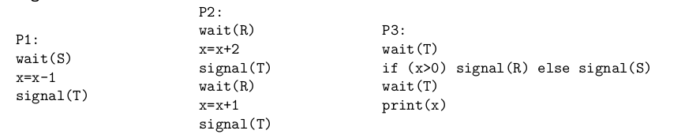

**DOMANDA 1**
Che invocazione sulla shell UNIX utilizzereste se volessimo assicurarci di modificare i diritti di accesso ai file ``.doc``contenuti nella cartella corrente secondo il criterio dopo esposto? I file devono mantenere i diritti precedenti ad eccezione dei diritti legati agli “altri utenti” (diversi dall’utente proprietario ed il gruppo proprietario) a cui deve essere negato qualunque accesso.

**RISPOSTA:** 

```bash
chmod o-rwx `ls | grep .doc`
```

``chmod permessi file``: cambia i permessi su un file
``o-rwx``: o indica gli utenti esterni al gruppo, il simbolo ``-`` la rimozione di permessi e r,w ed x sono i permessi di lettura, scrittura ed esecuzione.
``ls``: elenca i file nella directory specificata, se la directory non è specificata utilizza di default quella corrente. Esistono eventuali alias con piccole varianti come ad esempio ``ll``. Utilizzando il flag `-la` è possibile visualizzare i permessi inerenti il file.
`|`: pipe, redirige l'output del primo comando allo standard input del secondo.
`grep`: raggruppa i file in base ai parametri indicati, in questo caso in base all'estensione

**DOMANDA 2**
I sistemi UNIX supportano sui propri file-system sia i collegamenti simbolici (soft-link) che quelli fisici (hard link). Con riferimento a ciò che si può fare attraverso le chiamate di sistema, individuare tra le seguenti affermazioni quella errata.

A. Non è possibile creare un collegamento fisico ad un oggetto residente su un file-system diverso.
B. L’i-node a cui si accede usando un collegamento fisico è lo stesso a cui si accede usando il
riferimento originale.
C. Non è possibile creare un collegamento simbolico ad una directory.
D. E’ sempre possibile creare un collegamento simbolico ad un file di dispositivo speciale.
E. Non crea alcun problema creare un collegamento fisico ad un collegamento simbolico, purché
quest’ultimo sia consistente.

**RISPOSTA: La C è falsa.**

**DOMANDA 3**
Supponiamo di voler ignorare il segnale SIGINT (2) in un nostro programma scritto in C. Che chiamata di sistema utilizzereste tra le seguenti?

A. `alarm(SIGINT, 0);`
B. `kill(SIGINT);`
C. `armor(SIGINT, null);`
D. `wait(getpid(), SIGINT);`
E. `signal(SIGINT, SIG IGN);`

**RISPOSTA: E.**

**DOMANDA 4**
Supponiamo di eseguire la seguente sequenza di comandi su una shell UNIX all’interno di una cartella vuota:

```bash
echo -e "Franco\nGiovanni\nDario" > nomi.txt
ln -s nomi.txt nomi2.txt
cat nomi.txt | grep ’n’ > nomi3.txt
mv nomi3.txt nomi.txt
rm nomi.txt
cat nomi2.txt
```

Secondo voi, quale è l’output dell’ultimo comando?

**RISPOSA: un comando di errore di file/directory non esistente visto che `nomi2.txt` è un link simbolico a un file eliminato.**

**DOMANDA 5**
Abbiamo visto vari algoritmi di scheduling dei movimenti della testina di un disco rotazionale che permettono di ottimizzare vari parametri. In particolare ci siamo soffermati sul *“seek time”*. Supponiamo di avere una determinata sequenza di richieste di I/O e che i numeri di cilindro associati a tale richieste siano, in ordine di arrivo, i seguenti: **73, 15,** **11, 59, 80, 45, 90, 2**. Assumiamo che: la testina, all’arrivo della prima richiesta (ovvero quella per il cilindro 73), sia già posizionata sul cilindro 50; che i cilindri siano in totale 100 e che siano numerati da 0 a 99. Supponendo di utilizzare l’algoritmo di scheduling “*shortest seek time first*”, indicare la sequenza esatta che si andrebbe ad utilizzare e la distanza totale coperta dalla testina in termini di numero di cilindri attraversati.

**RISPOSTA: Assumendo tempi di arrivo nulli, vengono schedulate in ordine le richiester per: 45, 59, 73, 80, 90, 15, 11, 2, con rispettive distanze:**

**$ 50 \to 45 = 5$**
**$ 45 \to 59 = 14$**
**$ 59 \to 73 = 14$**
**$ 73 \to 80 = 7$**
**$ 80 \to 90 = 10$**
**$ 90 \to 15 = 75$**
**$ 15 \to 11 = 4$**
**$ 11 \to 2 = 9$**

**DOMANDA 6**
Consideriamo il seguente codice in C una volta compilato ed eseguito su un sistema UNIX:

```c
main() {
 	int pid, i;
 	for (i=0; i<=3; i++) {
  		pid=fork();
  		if (pid==0 && i!=2)
   			exit(0);
 	}
 	exit(0);
}
```

Determinare il numero esatto di processi generati da tale codice (compreso quello direttamente
creato dalla shell in seguito all’invocazione)

**RISPOSTA: vengono generati un totale di 5 processi (4 figli + il processo padre) ma tutti i processi figli eccetto il processo generato alla terza (indice 2) interazione del ciclo vengono immediatamente terminati. Il processo figlio e il padre si concludono entrambi con la seconda `exit()` invece**.

**DOMANDA 7**
Supponiamo di utilizzare un algoritmo di scheduling preemptive come il Round-Robin: assumendo di avere un context switch effettuato in 5 ms e di usare quanti di tempo lunghi 50 ms, a quanto ammonta la percentuale di overhead per la gestione dell’interlacciamento dei processi? Riportare per esteso il calcolo della percentuale richiesta.

**RISPOSTA: avendo $n$ processi e un quanto di $50$ ms, ogni processo avrà diritto a circa $\frac{1}{n}$ della CPU e attenderà al più $(n-1)50 + 5n $ ms, dove $5n$ è il tempo totale per la gestione del context switch su $n$ processi. L'overhead è quindi del $15\%$.**

**DOMANDA 8**
Con riferimento al problema dello scheduling quando applicato a sistemi multiprocessore, individuare quale delle seguenti affermazioni è errata.

A. Nella multielaborazione asimmetrica solo un core può operare sulle strutture interne al kernel
per la gestione dei processi.
B. La migrazione guidata dei processi e quella spontanea sono due tecniche compatibili tra di loro.
C. Nella multielaborazione simmetrica tutte i core sono considerati uguali.
D. La gestione del bilanciamento del carico delle varie CPU è superflua in caso di code private di
processi pronti per ogni CPU.
E. La necessità di supportare la predilezione per una CPU serve principalmente per ottenere una
migliore gestione della cache della memoria.

**RISPOSTA: La B è falsa.**

**DOMANDA 9**
Supponiamo di avere 3 processi che condividono una variabile $x$ e che i loro pseudo-codici siano i seguenti:



Determinare l’output del processo **P3** assumendo che il valore iniziale di $x$ è -2 e che i 3 semafori
abbiano i seguenti valori iniziali: **S=0, R=1, T=0.**

**RISPOSTA:**
**P1** fa una `wait()` bloccante su S, **P3** fa una `wait()` bloccante su **T**. La `wait()` di **P2** su R non è bloccante.

$ x = x + 2, x = -2 + 2\to x = 0$

**P2** fa una `signal()` su T e risveglia il processo **P3**, fa inoltre una `wait()` bloccante su R.
**P3** verifica la condizione $x > 0$ che risulta falsa. Fa una `signal()` su S e risveglia **P1**, dopo di ché fa un'altra `wait()` bloccante su T. **P1** sottrae 1 ad x

$ x = 0 \to x  = x - 1 \to x = -1 $

**P1 fa una `signal()` su T e risveglia P3 che stampa $-1$**

**DOMANDA 10**
Supponiamo di voler realizzare mutua esclusione all’interno di un processo con dei thread utente (modello “1-a-molti”): sappiamo che le soluzioni in genere utilizzate per i processi e i thread kernel hanno dei problemi in questo contesto. Come soluzione ad-hoc abbiamo visto i “mutex lock” che fanno uso dell’istruzione TSL. Scrivere in pseudo-assembly il codice delle funzioni mutex lock e mutex unlock.

**RISPOSTA:**

```assembly
mutex_lock:
	TSL REGISTER, MUTEX	| copia mutex nel registro e lo imposta a 1
	CMP REGISTER, #0
	JZE ok
	CALL thread_yield
	JMP mutex_lock
ok: RET

mutex_unlock:
	MOVE MUTEX, #0
	RET
```

