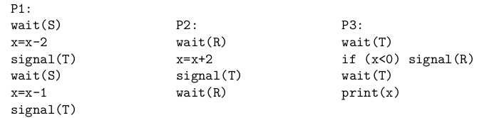

**DOMANDA 1**
L’algoritmo di Aging per la sostituzione delle pagine prevede di mantenere un contatore C associato ad ogni pagina caricata in memoria. Tale contatore viene consultato nel momento in cui si deve scegliere quale pagina rimuovere dalla memoria: viene scelta quella con il contatore più basso. Indicare esattamente qual è l’aggiornamento periodico che viene effettuato su tale contatore.

A. Somma del bit di referenziamento R al contatore C, con seguente shift a sinistra.
B. Shift a sinistra di C e somma del bit di referenziamento R.
C. Shift a sinistra di C ed inserimento del bit di referenziamento R come bit più significativo.
D. Shift a destra di C ed inserimento del bit di referenziamento R come bit più significativo.
E. Shift a destra di C ed inserimento del bit di modifica M come bit meno significativo.

**RISPOSTA: C.**

**DOMANDA 2**
Supponiamo di eseguire la seguente sequenza di comandi su una shell UNIX all’interno di una cartella vuota:

```bash
echo "ciao" > testo.txt
chmod g-r testo.txt
cat testo.txt 2> /dev/null && echo verde || echo rosso
```

Secondo voi, quale è l’output atteso dell’intera sequenza di comandi?

**RISPOSTA: Viene stampato ```ciao verde```. I permessi dell'utente non vengono modificati. Il comando ``cat`` redirige sullo standard output e la prima delle condizioni in or che risulta essere vera viene eseguita.**

**DOMANDA 3**
Con riferimento alle tecniche che abbiamo visto per memorizzare il contenuto dei file sui blocchi del disco e di come il file-system ne tenga traccia, individuare quale tra le seguenti affermazioni è falsa.

A. Nell’allocazione contigua è necessario conoscere a priori la dimensione massima del file in fase di creazione.
B. Nell’allocazione concatenata (con liste collegate) è presente una certa perdita di spazio dovuto alla frammentazione interna.
C. L’allocazione contigua è la soluzione che richiede meno memoria RAM ed il minor numero di accessi al disco per determinare il blocco in cui è memorizzato un arbitrario contenuto all’interno di un file.
D. Usando una FAT per tenere traccia dei blocchi dei file non è necessario mantenere una ulteriore bitmap per tenere traccia dei blocchi liberi.
E. Nell’allocazione che fa uso della tabella di allocazione dei file (FAT) la capacità del singolo blocco su disco può essere solo parzialmente sfruttata per memorizzare i contenuti del file, dovendo memorizzare il numero del blocco successivo

**RISPOSTA: La B è falsa.**

**DOMANDA 4**
Consideriamo un sistema che fa uso di memoria virtuale con le seguenti caratteristiche: uno spazio di indirizzamento virtuale da 1 Gb, un numero di pagina virtuale a 22 bit e un indirizzo fisico a 20 bit. Determinare esattamente quanti frame fisici ci sono in memoria.

**RISPOSTA:**
Uno spazio degli indirizzi di 1GB è formato da $2^{30}$​ bytes.
Gli indirizzi fisici hanno lunghezza 20 bit.
Avendo indirizzi virtuali da 22 bit abbiamo $2^{22}$ pagine virtuali.

Calcoliamo la dimensione della singola pagina, che è anche la grandezza dell'offset:
$\frac{2^{30}}{2^{22}} = 2^8 dim.pagina$

Ricaviamo il numero di frame totali:
$\frac{2^{20}}{2^8} = 2^{12} frame$

**RISPOSTA: Ci sono $2^{12}$ frame.**

**DOMANDA 5**
Supponiamo di avere 3 processi che condividono una variabile ``x`` e che i loro pseudo-codici siano i seguenti:



Determinare l’output del processo **P3** assumendo che il valore iniziale di ``x`` è 1 e che i 3 semafori abbiano i seguenti valori iniziali: **S=1, R=0, T=0.**

**RISPOSTA**:
Parte il processo **P1** perché è l'unico a fare una ``wait`` non bloccante.
$x = 1 \to x = x -2 \to x = -1$

**P1** fa una ``signal`` su **T** e risveglia **P3**.

**P1** fa una ``wait`` bloccante su **S**.
$S = 1 \to S = 0$

**P3** fa una ``signal`` su **R** e una ``wait`` su **T**.
$T = 1 \to T = 0, R=0 \to R=1$
**P3** si blocca.

**P2** si risveglia e fa una ``wait`` su **R**.
$x = x+2 \to x = -1 \to x = 1$

**P2** fa una ``signal`` su **T** e un'altra ``wait`` su **R**. Risveglia **P3** e si blocca.

**P3 stampa $x = 1$**